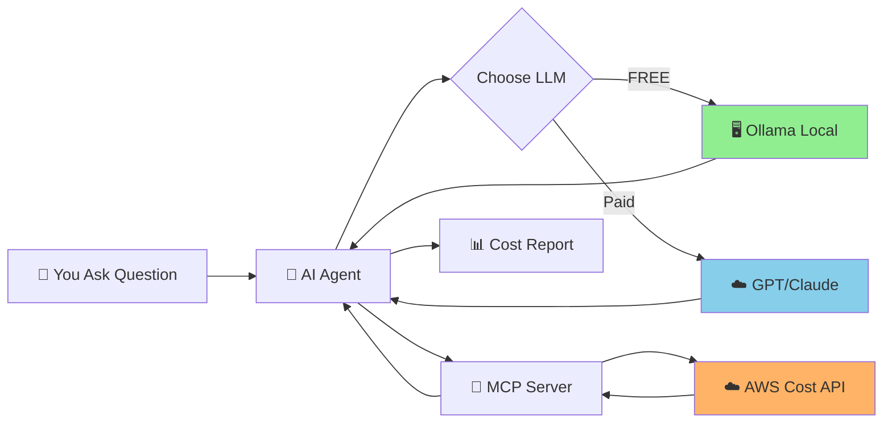

<div align="center">

# 🚀 AWS Cost Optimization System

### AI-Powered Cost Analysis with MCP Protocol

**🖥️ Local Ollama (FREE)** | **☁️ Claude/GPT Cloud**

[](https://www.python.org/downloads/)
[](LICENSE)
[](https://aws.amazon.com/aws-cost-management/)
[](https://modelcontextprotocol.io/)

*Ask questions about your AWS costs in plain English and get AI-powered insights*

</div>

---

## 🎯 What Does This Do?

Ask natural language questions about your AWS costs:

```
💬 "What were my AWS costs last month?"
💬 "Which services cost the most?"
💬 "Are there any unusual spending patterns?"
💬 "How can I reduce my AWS costs?"
```

Get instant AI-powered answers with cost breakdowns, forecasts, and optimization recommendations!

---

## ⚡ Quick Start (5 Minutes)

### 1️⃣ Install Dependencies

```bash
pip install -r requirements.txt
```

### 2️⃣ Configure Environment

```bash
cp .env.example .env
# Edit .env with your AWS credentials and LLM API key
```

### 3️⃣ Start MCP Server

```bash
python aws_cost_mcp_server.py
```

### 4️⃣ Ask Questions!

```bash
python agent_orchestrator.py "What were my AWS costs last month?"
```

---

## 🏗️ How It Works



### 🖥️ What Runs Where?

| Component | Location | Cost |
|-----------|----------|------|
| MCP Server | Your Computer | FREE |
| Agent | Your Computer | FREE |
| LLM (Ollama) | Your Computer | **FREE** ✨ |
| LLM (GPT/Claude) | Cloud | ~$0.01/query |
| AWS Cost Data | AWS Cloud | FREE |

---

## 🌟 Key Features

<table>
<tr>
<td width="50%">

### 🆓 Cost Options
- **FREE**: Use local Ollama (Qwen)
- **Paid**: OpenAI GPT or Claude
- **Flexible**: Switch anytime

</td>
<td width="50%">

### 🔧 5 Powerful Tools
- Cost & usage data
- Cost forecasts
- Anomaly detection
- Service breakdowns
- Optimization tips

</td>
</tr>
<tr>
<td width="50%">

### 🤖 AI-Powered
- Natural language queries
- Intelligent analysis
- Human-readable reports
- Multi-LLM support

</td>
<td width="50%">

### 🔒 Privacy & Control
- Runs on your machine
- Local LLM option
- No data sharing (with Ollama)
- Full control

</td>
</tr>
</table>

---

## 💡 Deployment Options

### Option 1: Fully Local (FREE) 🖥️

```bash
# Install Ollama
# Download from https://ollama.ai/

# Pull model (one-time, 4GB)
ollama pull qwen2.5:latest

# Start Ollama
ollama serve
```

**✅ Pros:** FREE, Private, Offline (except AWS calls)  
**❌ Cons:** Requires 8GB RAM, 4GB download

### Option 2: Cloud LLM (Easy) ☁️

```env
OPENAI_API_KEY=sk-proj-xxxxx
DEFAULT_LLM_PROVIDER=openai
```

**✅ Pros:** Better quality, Easy setup, Fast  
**❌ Cons:** ~$5-20/month, Requires internet

---

## 📖 Usage Examples

### Basic Cost Query

```python
from agent_orchestrator import AgentOrchestrator

agent = AgentOrchestrator()
response = agent.process_query("What were my total AWS costs for the last 30 days?")
print(response)
agent.close()
```

### Service Breakdown

```bash
python agent_orchestrator.py "Which AWS services cost the most?"
```

### Cost Forecast

```bash
python agent_orchestrator.py "What will my costs be next month?"
```

### Comprehensive Report

```bash
python agent_orchestrator.py "Generate a full cost report with optimization recommendations"
```

---

## 🧪 Testing

```bash
# Run all tests
pytest tests/

# Run with coverage
pytest tests/ --cov=.

# Run examples
python example_usage.py
```

---

## 🔐 AWS Setup

### Required IAM Permissions

```json
{
  "Version": "2012-10-17",
  "Statement": [{
    "Effect": "Allow",
    "Action": [
      "ce:GetCostAndUsage",
      "ce:GetCostForecast",
      "ce:GetAnomalies",
      "ce:GetRightsizingRecommendation",
      "ce:GetSavingsPlansPurchaseRecommendation"
    ],
    "Resource": "*"
  }]
}
```

### Enable Cost Explorer

1. Go to AWS Console → Cost Management
2. Enable Cost Explorer
3. Wait 24 hours for data

---

## 📁 Project Structure

```
sre-project-3/
├── agent_orchestrator.py    # AI agent with LLM
├── aws_cost_mcp_server.py   # MCP server (Flask)
├── mcp_client.py             # MCP client
├── aws_cost_service.py       # AWS API wrapper
├── config.py                 # Configuration
├── requirements.txt          # Dependencies
├── .env.example              # Config template
├── example_usage.py          # Examples
└── tests/                    # Test suite
```

---

## 🔍 Troubleshooting

<details>
<summary><b>MCP Server won't start</b></summary>

- Check port 8080 is not in use
- Verify Python 3.8+ installed
- Check `.env` file exists

</details>

<details>
<summary><b>AWS authentication errors</b></summary>

- Verify AWS credentials in `.env`
- Check IAM permissions
- Ensure Cost Explorer is enabled

</details>

<details>
<summary><b>Ollama connection issues</b></summary>

```bash
# Ensure Ollama is running
ollama serve

# Verify model is installed
ollama list

# Pull model if needed
ollama pull qwen2.5:latest
```

</details>

---

## 📚 Documentation

- 📖 [Setup Guide](SETUP_GUIDE.md) - Detailed setup instructions
- 🔧 [AWS Cost Explorer API](https://docs.aws.amazon.com/cost-management/latest/APIReference/Welcome.html)
- 🤖 [Model Context Protocol](https://modelcontextprotocol.io/)
- 🦙 [Ollama Documentation](https://ollama.ai/docs)

---

## 🤝 Contributing

Contributions welcome! Please feel free to submit a Pull Request.

---

## 📄 License

MIT License - See [LICENSE](LICENSE) file for details

---

<div align="center">

**Made with ❤️ for AWS Cost Optimization**

⭐ Star this repo if you find it useful!

</div>
