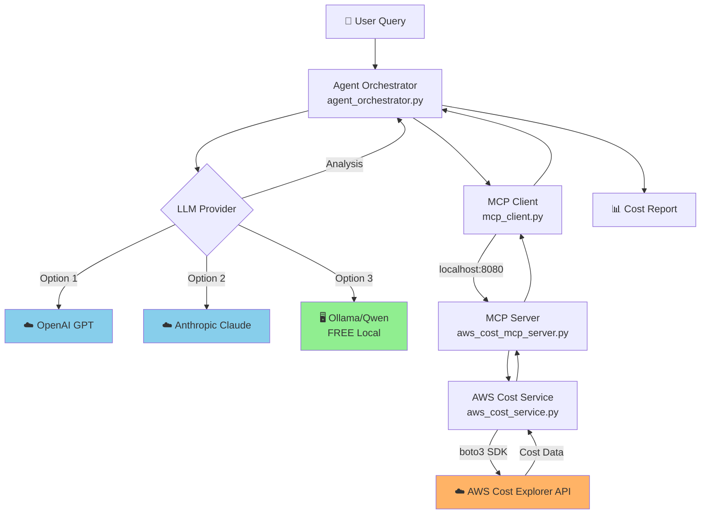
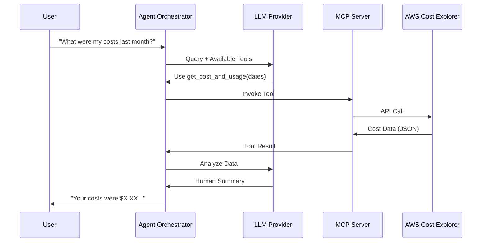

# AWS Cost Monitoring System with MCP Protocol

> 🖥️ **Local Ollama** / ☁️ **Claude Cloud** - AI-Powered Cost Analysis

A production-ready system that uses the Model Context Protocol (MCP) to connect LLM agents (local Ollama or cloud Claude/GPT) with AWS Cost Explorer and Billing APIs for automated cost analysis and optimization recommendations.

[](https://www.python.org/downloads/)
[](LICENSE)
[](https://aws.amazon.com/aws-cost-management/)
[](https://modelcontextprotocol.io/)

## 📑 Table of Contents

- [Architecture Overview](#️-architecture-overview)
- [Key Features](#-key-features)
- [Deployment Options](#-deployment-options)
- [Quick Start](#-quick-start)
- [Usage Examples](#-usage-examples)
- [Testing](#-testing)
- [AWS IAM Permissions](#-aws-iam-permissions)
- [Troubleshooting](#-troubleshooting)

---

## 🏗️ Architecture Overview

### System Components



### 🖥️ Local vs ☁️ Cloud

| Component | Runs On | Required | Notes |
|-----------|---------|----------|-------|
| **MCP Server** | 🖥️ Your Machine | ✅ | Flask on localhost:8080 |
| **Agent Orchestrator** | 🖥️ Your Machine | ✅ | Processes queries locally |
| **MCP Client** | 🖥️ Your Machine | ✅ | HTTP client |
| **AWS Cost Service** | 🖥️ Your Machine | ✅ | boto3 wrapper |
| **LLM Provider** | 🖥️ Local OR ☁️ Cloud | ✅ | Choose one option |
| **AWS Cost Explorer** | ☁️ AWS Cloud | ✅ | Your AWS account |

### 📊 Data Flow



### 🔧 Available MCP Tools

The MCP server exposes **5 powerful tools**:

1. **`get_cost_and_usage`** - Retrieve cost data for specified time periods
2. **`get_cost_forecast`** - Get cost forecasts for future periods  
3. **`get_cost_anomalies`** - Detect unusual spending patterns
4. **`get_service_costs`** - Break down costs by AWS service
5. **`get_optimization_recommendations`** - Fetch AWS optimization suggestions

## ✨ Key Features

- **Multi-LLM Support**: Works with OpenAI GPT, Anthropic Claude, or local models via Ollama
- **MCP Protocol**: Standard interface for tool integration between LLMs and AWS services
- **Comprehensive Cost Analysis**: Retrieve cost data, forecasts, anomalies, and service breakdowns
- **AI-Powered Insights**: Natural language queries for cost analysis
- **Optimization Recommendations**: AWS Cost Explorer recommendations for savings
- **Production Ready**: Error handling, logging, and configuration management

## 🌐 Deployment Options

### Local vs Cloud Components

| Component | Location | Required | Notes |
|-----------|----------|----------|-------|
| **MCP Server** | 🖥️ Local | ✅ Yes | Runs on localhost:8080 |
| **Agent Orchestrator** | 🖥️ Local | ✅ Yes | Executes queries locally |
| **MCP Client** | 🖥️ Local | ✅ Yes | HTTP client for MCP server |
| **AWS Cost Service** | 🖥️ Local | ✅ Yes | boto3 wrapper |
| **LLM Provider** | ☁️ Cloud or 🖥️ Local | ✅ Yes | Choose one option below |
| **AWS Cost Explorer** | ☁️ Cloud | ✅ Yes | Your AWS account |

### LLM Provider Options

#### Option 1: OpenAI GPT (Cloud) ☁️
- **Location**: Cloud API
- **Cost**: Pay-per-use (~$0.01-0.03 per query)
- **Quality**: Excellent
- **Setup**: Easy (just API key)
- **Internet**: Required

```env
OPENAI_API_KEY=sk-proj-xxxxx
DEFAULT_LLM_PROVIDER=openai
```

#### Option 2: Anthropic Claude (Cloud) ☁️
- **Location**: Cloud API
- **Cost**: Pay-per-use (~$0.01-0.03 per query)
- **Quality**: Excellent
- **Setup**: Easy (just API key)
- **Internet**: Required

```env
ANTHROPIC_API_KEY=sk-ant-xxxxx
DEFAULT_LLM_PROVIDER=anthropic
```

#### Option 3: Ollama with Qwen (Local) 🖥️ **RECOMMENDED FOR COST SAVINGS**
- **Location**: Runs on your machine
- **Cost**: **FREE** (one-time 4GB download)
- **Quality**: Very good
- **Setup**: Moderate (install Ollama + pull model)
- **Internet**: Only for initial download

```bash
# One-time setup
ollama pull qwen2.5:latest

# Start Ollama server
ollama serve
```

```env
OLLAMA_BASE_URL=http://localhost:11434
OLLAMA_MODEL=qwen2.5:latest
DEFAULT_LLM_PROVIDER=ollama
```

### Deployment Scenarios

#### Scenario 1: Fully Local (Maximum Privacy) 🔒
```
Components Running Locally:
✅ MCP Server (localhost)
✅ Agent Orchestrator (localhost)
✅ LLM (Ollama - localhost)

Cloud Services:
☁️ AWS Cost Explorer API only

Pros:
+ No LLM API costs
+ Data stays on your machine
+ Works offline (except AWS calls)
+ Full control

Cons:
- Requires ~8GB RAM for Ollama
- Initial model download (4GB)
```

#### Scenario 2: Hybrid (Best Balance) ⚖️
```
Components Running Locally:
✅ MCP Server (localhost)
✅ Agent Orchestrator (localhost)

Cloud Services:
☁️ LLM (OpenAI/Anthropic)
☁️ AWS Cost Explorer API

Pros:
+ Better AI quality
+ Lower resource usage
+ Easier setup
+ Faster responses

Cons:
- LLM API costs (~$0.01-0.03/query)
- Requires internet
- Data sent to LLM provider
```

#### Scenario 3: Future Cloud Deployment (Advanced) 🚀
```
Deploy entire system to cloud:
☁️ AWS Lambda / EC2 / ECS
☁️ MCP Server (cloud-hosted)
☁️ Agent as API endpoint
☁️ LLM (OpenAI/Anthropic)
☁️ AWS Cost Explorer API

Pros:
+ Accessible from anywhere
+ Scalable
+ Can build web dashboard
+ Scheduled reports

Cons:
- Additional cloud costs
- More complex setup
- Not implemented yet (future enhancement)
```

### Cost Comparison

| Deployment | Setup Time | Monthly Cost | Privacy | Performance |
|------------|------------|--------------|---------|-------------|
| **Fully Local (Ollama)** | 30 min | $0 | ⭐⭐⭐⭐⭐ | ⭐⭐⭐⭐ |
| **Hybrid (OpenAI)** | 15 min | ~$5-20 | ⭐⭐⭐ | ⭐⭐⭐⭐⭐ |
| **Hybrid (Claude)** | 15 min | ~$5-20 | ⭐⭐⭐ | ⭐⭐⭐⭐⭐ |

*Monthly cost assumes ~100-500 queries/month. AWS Cost Explorer API is free for most use cases.*

## 📁 Project Structure

```
aws-cost-monitoring/
├── aws_cost_mcp_server.py      # MCP server implementation
├── agent_orchestrator.py        # LLM agent with MCP client
├── mcp_client.py                # MCP protocol client
├── aws_cost_service.py          # AWS API wrapper
├── config.py                    # Configuration management
├── requirements.txt             # Python dependencies
├── .env.example                 # Environment template
├── example_usage.py             # Usage examples
├── README.md                    # This file
├── SETUP_GUIDE.md              # Detailed setup instructions
└── tests/                       # Test suite
    ├── __init__.py
    ├── test_mcp_server.py
    └── test_agent.py
```

## 🚀 Quick Start

### 1. Install Dependencies

```bash
pip install -r requirements.txt
```

### 2. Configure Environment

Copy `.env.example` to `.env` and fill in your credentials:

```bash
cp .env.example .env
```

Edit `.env`:
```env
# AWS Credentials
AWS_ACCESS_KEY_ID=your_access_key_here
AWS_SECRET_ACCESS_KEY=your_secret_key_here
AWS_DEFAULT_REGION=us-east-1

# LLM API Keys (choose one or more)
OPENAI_API_KEY=your_openai_api_key_here
ANTHROPIC_API_KEY=your_anthropic_api_key_here

# Default LLM Provider
DEFAULT_LLM_PROVIDER=openai
```

### 3. Start the MCP Server

```bash
python aws_cost_mcp_server.py
```

The server will start on `http://localhost:8080`

### 4. Run the Agent

In a new terminal:

```bash
# Simple query
python agent_orchestrator.py "What were my AWS costs last month?"

# Or run examples
python example_usage.py
```

## 💡 Usage Examples

### Basic Cost Query

```python
from agent_orchestrator import AgentOrchestrator

agent = AgentOrchestrator()
response = agent.process_query("What were my total AWS costs for the last 30 days?")
print(response)
agent.close()
```

### Service Breakdown

```python
response = agent.process_query(
    "Break down my AWS costs by service for the last month. Which services cost the most?"
)
```

### Cost Forecast

```python
response = agent.process_query(
    "What is my forecasted AWS cost for the next 30 days?"
)
```

### Anomaly Detection

```python
response = agent.process_query(
    "Are there any unusual spending patterns or cost anomalies in the last 30 days?"
)
```

### Optimization Recommendations

```python
response = agent.process_query(
    "What are the top cost optimization recommendations for my AWS account?"
)
```

### Comprehensive Report

```python
response = agent.process_query(
    "Generate a comprehensive AWS cost report for the last 30 days including: "
    "1) Total costs, 2) Cost breakdown by service, 3) Any anomalies detected, "
    "4) Cost forecast for next month, and 5) Top optimization recommendations."
)
```

### Using Different LLM Backends

```python
# OpenAI GPT
agent = AgentOrchestrator(llm_provider='openai')

# Anthropic Claude
agent = AgentOrchestrator(llm_provider='anthropic')

# Local Ollama
agent = AgentOrchestrator(llm_provider='ollama')
```

## 🔧 Available MCP Tools

The MCP server exposes the following tools:

1. **get_cost_and_usage**: Retrieve cost data for specified time periods
2. **get_cost_forecast**: Get cost forecasts for future periods
3. **get_cost_anomalies**: Detect unusual spending patterns
4. **get_service_costs**: Break down costs by AWS service
5. **get_optimization_recommendations**: Fetch AWS Cost Explorer recommendations

## 🧪 Testing

Run the test suite:

```bash
# Run all tests
pytest tests/

# Run with coverage
pytest tests/ --cov=. --cov-report=html

# Run specific test file
pytest tests/test_mcp_server.py -v
```

## 📋 AWS IAM Permissions

Your AWS user/role needs the following permissions:

```json
{
  "Version": "2012-10-17",
  "Statement": [
    {
      "Effect": "Allow",
      "Action": [
        "ce:GetCostAndUsage",
        "ce:GetCostForecast",
        "ce:GetAnomalies",
        "ce:GetRightsizingRecommendation",
        "ce:GetSavingsPlansPurchaseRecommendation"
      ],
      "Resource": "*"
    }
  ]
}
```

## 🔍 Troubleshooting

### MCP Server Connection Issues

- Ensure the MCP server is running on the correct port
- Check firewall settings
- Verify `MCP_SERVER_HOST` and `MCP_SERVER_PORT` in `.env`

### AWS Authentication Errors

- Verify AWS credentials are correct
- Check IAM permissions
- Ensure the AWS region is valid

### LLM API Errors

- Verify API keys are correct
- Check API rate limits
- Ensure sufficient API credits

### Ollama Connection Issues

- Ensure Ollama is running: `ollama serve`
- Verify the model is pulled: `ollama pull qwen2.5`
- Check `OLLAMA_BASE_URL` in `.env`

## 📚 Additional Resources

- [AWS Cost Explorer API Documentation](https://docs.aws.amazon.com/cost-management/latest/APIReference/Welcome.html)
- [Model Context Protocol Specification](https://modelcontextprotocol.io/)
- [OpenAI API Documentation](https://platform.openai.com/docs/api-reference)
- [Anthropic API Documentation](https://docs.anthropic.com/claude/reference/getting-started-with-the-api)
- [Ollama Documentation](https://ollama.ai/docs)

## 📄 License

MIT License - See LICENSE file for details

## 🤝 Contributing

Contributions are welcome! Please feel free to submit a Pull Request.

## 📧 Support

For issues and questions, please open an issue on the GitHub repository.
# AWS-Cost-Monitoring-Optimization-Agent-using-MCP-Ollama-Local-Claude-Cloud-

